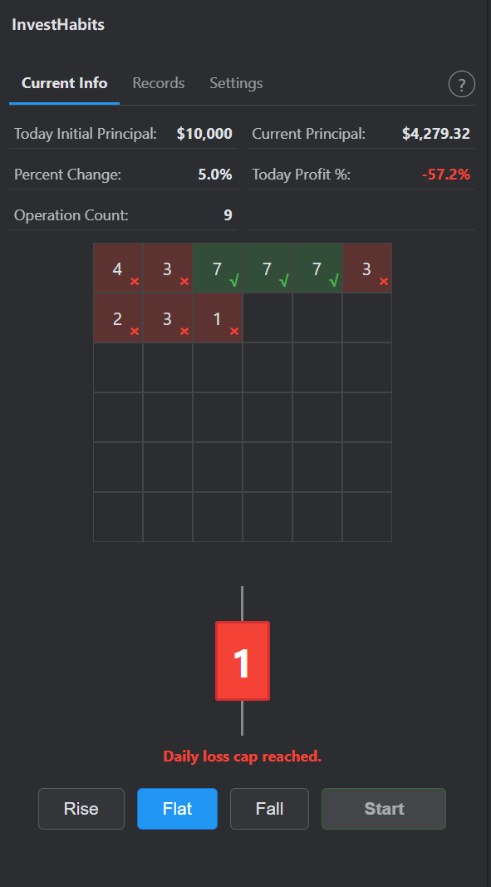
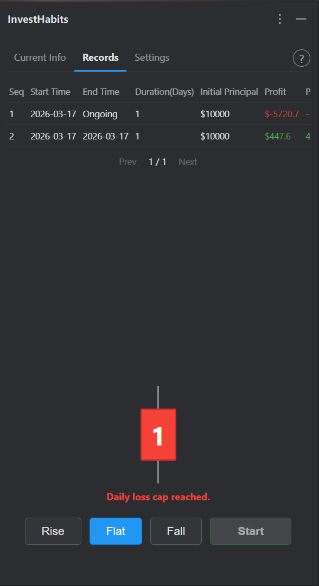
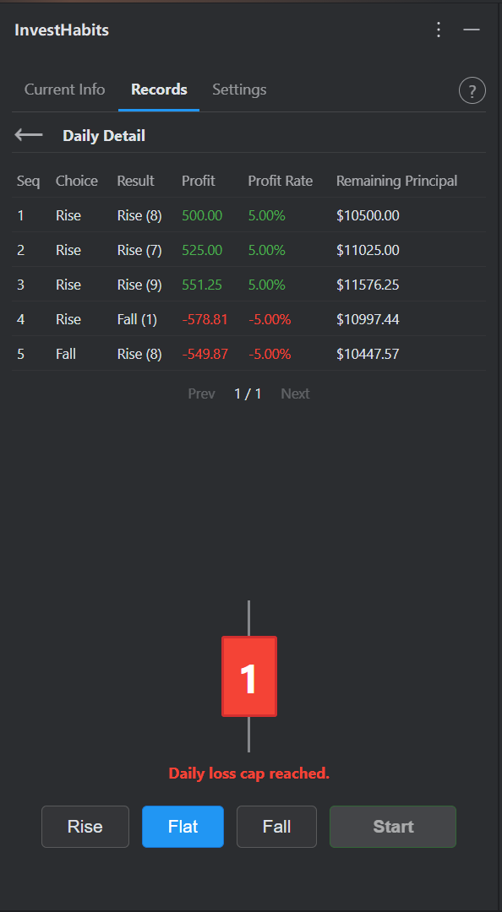
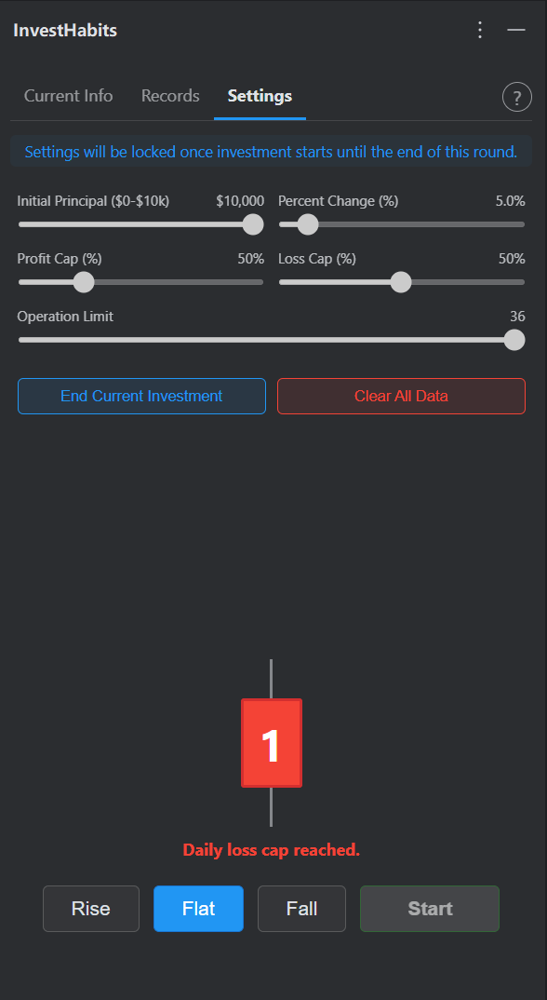
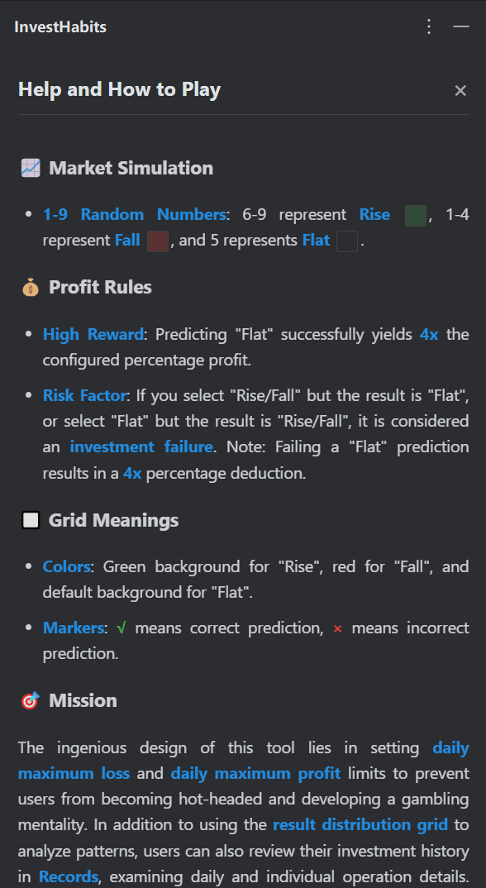

# InvestHabits - Investment Mentality Training

[中文版](./README.md) | **English**

**InvestHabits** is an IDE-embedded investment mentality simulation tool designed specifically for developers. By simulating market fluctuations with random numbers (1-9), it helps you exercise decisiveness and risk control awareness during coding breaks.

---

## 🌟 Introduction

InvestHabits seamlessly integrates into the IntelliJ IDEA interface, providing a clean simulation experience through the Tool Window. It is not just a simulator, but a mental training ground. Through different simulation environments, it guides developers to make calm and wise investment decisions.

### Core Highlights:
- **Capability Improvement**: Emphasizes cultivating good and winning investment habits through simulation training to improve personal investment capability.
- **Anti-Gambling & Risk Control**: The ingenious design of this tool lies in setting **daily maximum loss** and **daily maximum profit** limits to prevent users from becoming hot-headed and developing a gambling mentality. Beyond analyzing fluctuation patterns via the **result distribution grid**, you can also review every detailed operation through the **Records** function. This data allows you to precisely capture your decision-making details, track the cultivation of your investment habits, and witness the steady progress of your personal capabilities. The ultimate goal is to help users develop the habit of carefully finding patterns, maintaining calm, wise, and stable operations, and accumulating great wealth through long-term, stable, small daily profits.
- **Result Distribution**: An intuitive 6x6 grid showing the distribution of today's operations. Green squares represent "Rise", red represent "Fall", and the default color represents "Flat". "√" and "×" indicate success and failure respectively.
- **Contrarian Thinking**: Accurately predicting a "Flat" result yields 4x profit; however, failing a "Flat" prediction also carries a 4x loss risk.

---

## 📷 Screenshots

  
  
  
  
  

---

## ✨ Features

- **Current Info**: Real-time display of today's initial principal, current balance, profit percentage, and operation distribution grid.
- **High Rewards**: In the simulated market, accurately predicting a "Flat" outcome yields 4x more profit than a regular rise or fall, testing your contrarian thinking.
- **Investment Cycles**: Manage complete investment rounds from initial capital to bankruptcy or manual settlement.
- **Locking Mechanism**: Key settings automatically lock once an investment round begins to ensure serious and consistent training.
- **Help System**: Built-in guide, click the `?` icon anytime to see detailed rules.
- **Multi-language Support**: Native support for Chinese, English, Japanese, and Korean.

---

## 🛠️ Installation

1. Open IntelliJ IDEA.
2. Go to `Settings` (Windows/Linux) or `Settings/Preferences` (macOS).
3. Select `Plugins` and search for **InvestHabits**.
4. Click `Install` and restart as prompted.
5. After installation, find the **InvestHabits** icon in the side toolbar to start training.

---

## 💰 Commercial Plugin Notice

**InvestHabits is a commercial plugin.**

This plugin is commercial software protected by copyright law. We provide a high-quality, continuously maintained simulation experience.

- **Trial Period**: Enjoy a limited free trial period.
- **Official License**: Purchase an official license at the [JetBrains Marketplace](https://plugins.jetbrains.com/plugin/com.kuyou.InvestHabits).

---

## 📞 Contact & Feedback

- **Vendor**: LittleRelaxation
- **Marketplace**: [InvestHabits on Marketplace](https://plugins.jetbrains.com/plugin/com.kuyou.InvestHabits)

---

© 2026 LittleRelaxation. All rights reserved.
